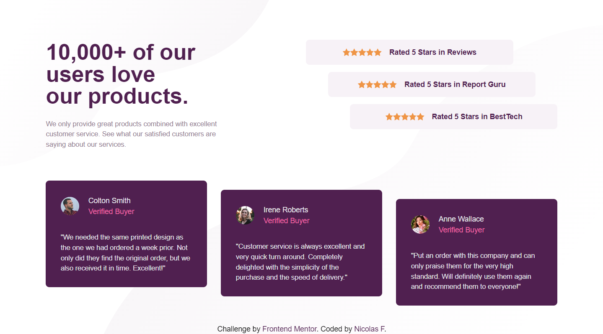
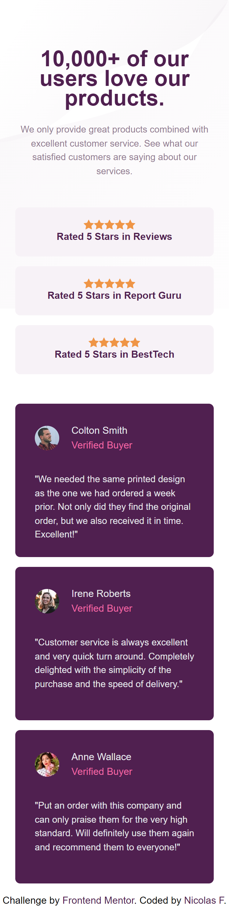

# Frontend Mentor - Social proof section solution

This is a solution to the [Social proof section challenge on Frontend Mentor](https://www.frontendmentor.io/challenges/social-proof-section-6e0qTv_bA). Frontend Mentor challenges help you improve your coding skills by building realistic projects.

## Table of contents

- [Overview](#overview)
  - [The challenge](#the-challenge)
  - [Screenshots](#screenshots)
  - [Links](#links)
- [My process](#my-process)
  - [Built with](#built-with)
  - [What I learned](#what-i-learned)
  - [Continued development](#continued-development)
  - [Useful resources](#useful-resources)
- [Author](#author)
- [Acknowledgments](#acknowledgments)

## Overview

### The challenge

Users should be able to:

Your challenge is to build out this social proof section and get it looking as close to the design as possible.

You can use any tools you like to help you complete the challenge. So if you've got something you'd like to practice, feel free to give it a go.

Your users should be able to:

- View the optimal layout for the section depending on their device's screen size

### Screenshots




### Links

- Solution URL: [Code](https://github.com/nicolasfig/social-proof-section)
- Live Site URL: [Live site](https://nicolasfig.github.io/social-proof-section/)

## My process

### Built with

- Semantic HTML5 markup
- CSS custom properties
- Flexbox
- Mobile-first workflow
- [Tailwind](https://tailwindcss.com/) - css framework

### What I learned

This was my first time building a mobile-first site and my second tailwind site learned a lot about tailwind, how to use the config file, how to set breakpoints, how custom values for tailwind rules, it was a great experience.

The custom background rules I used in the tailwind config file

```js
extend: {
      backgroundImage: {
        mobile:
          "url(./images/bg-pattern-top-mobile.svg), url(./images/bg-pattern-bottom-mobile.svg)",
        desktop:
          "url(./images/bg-pattern-top-desktop.svg), url(./images/bg-pattern-bottom-desktop.svg)",
      },
      backgroundPosition: {
        pos: "left top, right bottom",
      },
};
```

How I used it

```html
<body
  class="bg-mobile font-spartan flex flex-col items-center justify-between h-screen w-screen desktop:justify-center desktop:bg-desktop desktop:bg-pos bg-no-repeat"
></body>
```

### Useful resources

- [Tailwind docs](https://tailwindcss.com/docs/installation) - A must if you're building sites using tailwind

## Author

- Frontend Mentor - [@nicolasfig](https://www.frontendmentor.io/profile/nicolasfig)

## Acknowledgments

- [Dave Gray tailwind course](https://www.youtube.com/watch?v=lCxcTsOHrjo) - This course helped me a lot with the setup steps
